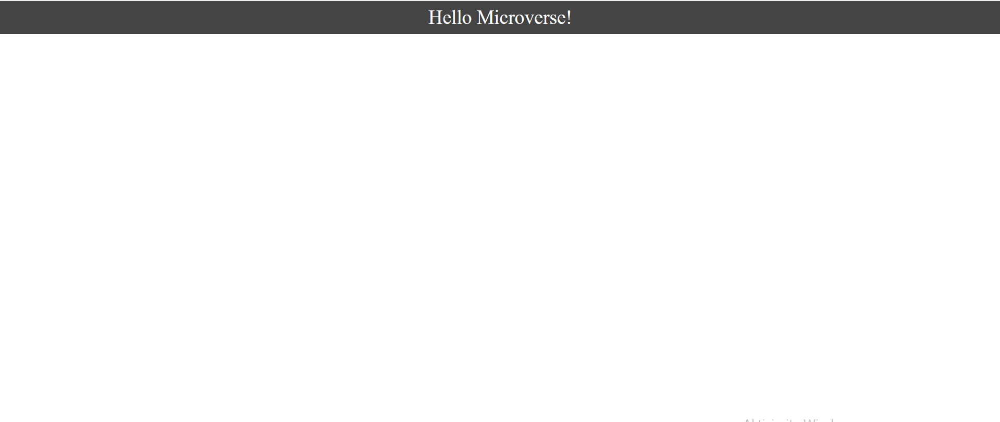

# Hello Microverse

> This is my first project in the Microverse program.

In this project, we covered some basic things in github

## Built With

- HTML
- CSS

## Live Demo

No Live Preview

## Authors

👤 **Author1**

- GitHub: [@githubhandle](https://github.com/vladanvi99)
- Twitter: [@twitterhandle](https://twitter.com/vladanvi99)
- LinkedIn: [LinkedIn](https://www.linkedin.com/in/vladan-videnovi%C4%87-780bb11b2/)

## 🤝 Contributing

Contributions, issues, and feature requests are welcome!

Feel free to check the [issues page](../../issues/).

## Show your support

Give a ⭐️ if you like this project!

## Acknowledgments

- Hat tip to anyone whose code was used
- Inspiration
- etc

## 📝 License

This project is [MIT](./MIT.md) licensed.
